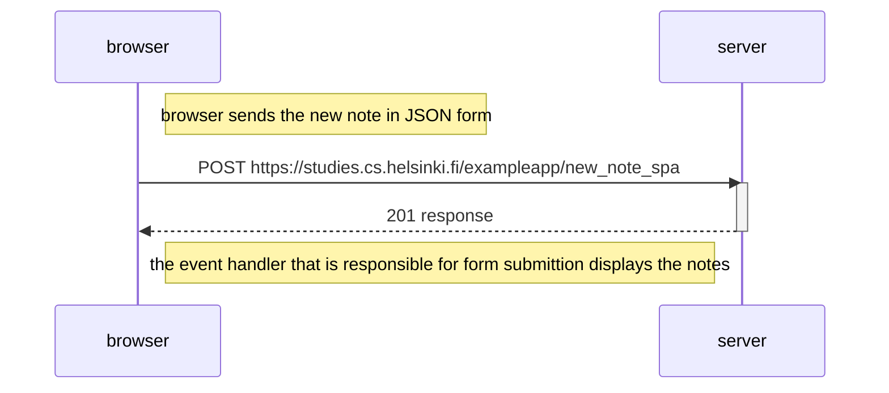

```mermaid
sequenceDiagram
    participant browser
    participant server

    note right of browser: browser sends the new note in JSON form

    browser->>server: POST https://studies.cs.helsinki.fi/exampleapp/new_note_spa
    activate server
    server-->>browser: 201 response
    deactivate server

    note right of browser: the event handler that is responsible for form submittion displays the notes
```